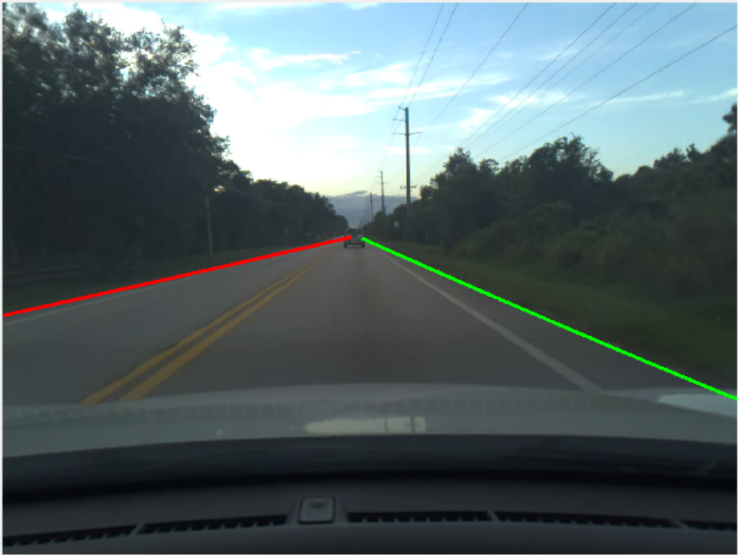

# Pretrained RESA Network For Road Boundary Detection

This repository provides a pretrained RESA [1] network for MATLAB®, trained on the Comma10k [2] dataset for road boundary detection. The RESA network was originally proposed for lane detection, but this version has been trained to detect road boundaries extracted from the Comma10k dataset.

**Creator**: MathWorks Development

**Includes un-trained model**: :x:  

**Includes transfer learning script**: :x:  


## Requirements
- MATLAB® R2022b or later
- Deep Learning Toolbox
- Computer Vision Toolbox


## Getting Started
Download or clone this repository to your machine and open it in MATLAB®.

### Setup
Add path to the source directory.

```matlab
addpath(genpath('src'));
```

### Download the pretrained network
Use the code below to download the pretrained network.

```matlab
model = helper.downloadPretrainedRoadBoundaryDetection;
net = model.net;
```

### Detect Road Boundaries Using Pretrained RESA model
Use to code below to perform detection on an example image using the pretrained model.

```matlab
% Read test image.
img = imread(fullfile("images", "testImage.png"));

% Specify parameters for road boundary detection
params = helper.createDetectionParameters;

% Specify the executionEnvironment as either "cpu", "gpu", or "auto".
executionEnvironment = "auto";

% Call detectRoadBoundaries to detect the road boundaries.
roadBoundaries = detectRoadBoundaries(net, img, params, executionEnvironment);

% Visualize the detected lanes.
fig = figure;
helper.plotBoundaries(fig, img, roadBoundaries);
```


Alternatively, you can also run the model on sample videos. Use the script roadBoundaryVideoDetection.m to run the inference on a driving scene.

## Network Details
RESA is one of the best performing lane detection architectures. It takes advantage of strong shape priors of lanes and captures spatial relationships of pixels across rows and columns. This repository leverages the RESA architecture for road boundary detection. The road boundary labels used for training were generated by labeling the Comma10k dataset.


## References
[1] Zheng, Tu et al. "RESA: Recurrent Feature-Shift Aggregator for Lane Detection." AAAI (2021).

[2] https://github.com/commaai/comma10k

Copyright 2022 The MathWorks, Inc.
